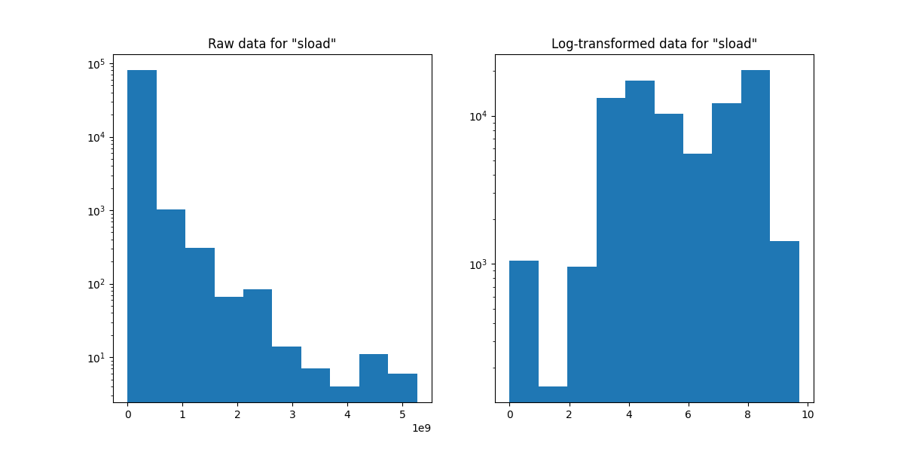
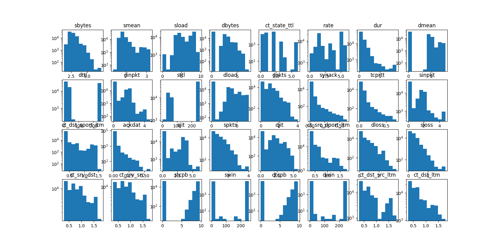
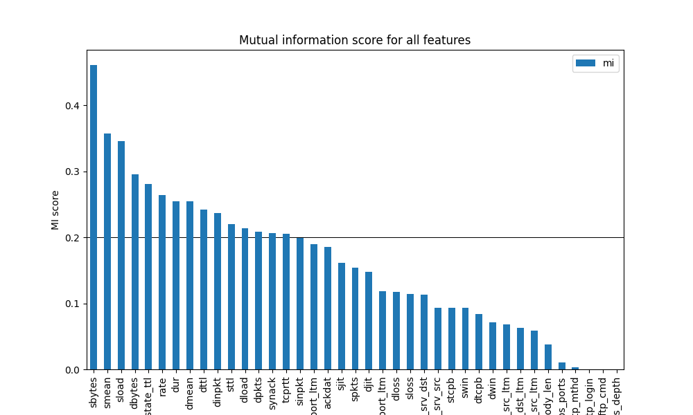

# Elements of Data Processing Project

## Table of Contents
* [Run Instructions](#Run-Instructions)
* [Aim](#Aim)
* [Pre-processing](#Pre-processing)
* [Analysis Methods](#Analysis-Methods)
* [Modelling](#Modelling)
* [Discussion](#Discussion)
* [kNN](#kNN)
* [Decision Tree](#Decision-Tree)
* [Model Comparison](#Model-Comparison)
* [Conclusion](#Conclusion)
* [References](#References)

## Run Instructions

Datasets have been deleted due to size restrictions on Edstem. Add the `security/UNSW_NB15_dataset.csv` file
before running anything else.

`preprocessing.ipynb` handles preprocessing of the raw dataset, and should be run first to generate
`modifiedDatasets/preprocessed.csv`

`kSelection.ipynb` contains the code that chooses k for kNN, and should be run next

`analysis.ipynb` contains model training and performance evaluation, and should be run last

All can be run in the standard way that ipynb notebooks may be run.

## Aim
This project explores network packet transmission data, aiming to investigate whether we can classify network activity as normal or malicious based upon packet transmission metadata using supervised machine learning techniques. The project further aims to determine which features can be specifically used to distinguish between the two types of network activity. The results of this study may be useful for developing and improving Network-Based Intrusion Detection Systems (NIDSs), offering increased security and protection against cyberattacks for governments, businesses, and individuals to protect their network applications.
Dataset
One dataset was used in this project: a subset of the UNSW-NB 15 dataset (2015). This dataset is a CSV file curated by the Australian Centre for Cyber Security (ACCS), which aggregated a combination of real-life network packets, and packets generated from artificial simulations of a range of common network attacks. 49 different attributes that described packet flow between network and host were generated. The chosen target variable amongst these attributes for this report was the ‘label’ category, which contained a binary value indicating if the flow contained a malicious attack or not.
## Pre-processing
The features in the CSV dataset were immediately machine readable and did not need reformatting. The ‘id’ and ‘attack_cat’ features were dropped, as the ‘id’ field is a non-informative index, and ‘attack_cat’ is a more detailed specification of the network attack category and is directly related to our response variable ‘label’ of whether or not a packet is malicious. ‘Proto’, ‘service’ and ‘state’ are categorical features relating to the transmission protocol of the packet, and the application the packet is supporting. Due to a large number of categories within these features, these columns were not included in our analysis, and hence, our research focuses on general packet traits that determine whether a packet is malicious irrespective of the protocol/application.
Log-transformation
The remaining fields consist of 37 numerical features, 2 categorical features ‘is_sm_ips_ports’ and ‘is_ftp_login’, and the target feature ‘label’ of whether or not a packet is an attack. The two categorical features are excluded for k-nearest-neighbours (kNN) analysis, as a distance metric over its values is not well defined. Many of the remaining numerical features are not suitable for fitting a kNN model in their original form. The original value distributions of many features are heavily positively skewed, and hence, their values were log-transformed to shift their distributions closer to Gaussian, as seen in Figure 1 and Figure 2. An additional pre-processing step is performed during kNN model fitting by normalising the values of all numerical features, so differences between values in different features can be reasonably compared.

Figure 1. Histogram plots of "sload" before and after applying log scaling is applied.

Figure 2. Histogram plots of all features after applying log scaling.

### Outliers

All numeric features were inspected for outliers. Data points appear to all belong to one large underlying distribution for all features, and as a result, there are no clear indications of outliers. We decided to not remove any data points for our analysis.
Feature selection

Finally, due to the large number of features present in the dataset, feature selection was used to reduce the number of features used in model training to prevent overfitting. The Mutual Information (MI) statistic was calculated between all features and the response variable, and the features with MI scores below 0.2 were dropped, as shown in Figure 3.

Figure 3. Bar chart of mutual information scores for each feature in the dataset.

## Analysis Methods
For analyses we used supervised classification techniques because we are fitting a categorical target variable. A kNN model is appropriate as we are fitting the target to various continuous predictors. The drawbacks of using kNN is that due to the large number of features, we cannot gain considerable insight into the model as visualising the found relationships is difficult. kNN also requires a standardised distribution of feature values to make distances comparable, which may not be satisfied by our features. kNN is also sensitive to outliers which will likely appear in our network traffic dataset, potentially leading to lower accuracy for our prediction model.
Multiple regression was not considered, as we do not have a continuous target variable it was not appropriate. Similarly, clustering is not appropriate either as we have a target variable to fit, and hence need to perform supervised learning.

We also considered a decision tree model to complement our choice of kNN, as it offers a prediction model as well as an intuitive, visual representation which is useful for understanding which variables have more importance for predictions. By highlighting the most prominent features for predicting malicious attacks, we can offer valuable insights and understanding about this activity that can aid in the production and enhancement of NDISs.
Train-Test Split and Cross Validation
Prior to analyses, we split the data into training (80%) and testing (20%) sets to hold out a portion of the dataset to test the performance of our final model on unseen data.
We trained our models with our training data using k-fold cross-validation to ensure model performance is evaluated on a different set of data from what was used in training. A number of different folds are used, and the performance across folds is averaged to reduce variance among random training/validation splits. The overall effect should be a trained model less prone to overfitting, and hence better out of sample performance in real world scenarios.

## Modelling
To construct a predictive model for identifying malicious activity we applied the kNN algorithm to our 15 selected features. Multiple values of k were tested for the algorithm, with the average accuracy of the 10 folds being compared to select the best as seen in Figure 4. All tested values were odd to avoid ties between the target feature categories as the target feature can take on two states.

Figure 4. Model performance of kNN plotted against the number of nearest neighbours matched to.

To test an alternative model, we then generated a decision tree for the 15 features. The feature importance as decided by the model was visualised to provide insight into their relative contributions to the model as seen in Figure 

Figure 5. Bar chart of importance for each predictor feature in the DT
We used 10-fold cross validation on the train data from the train-test-split on both models in order to gain a more accurate test error reading by averaging across folds.

## Discussion
### kNN
The results of the kNN model show that it had an average accuracy across the 10 folds of 91.55%. The average confusion matrix across the 10 folds as seen in Figure 6. supports this, as the majority of the data is classified as either true positive or true negative results. The average recall and precision of the model across the 10 folds are 90.20% and 94.21% respectively, showing strong performance by the prediction model in identifying and labelling attacks correctly.
kNN assumes a scaled distribution for all features to make distances comparable, and in spite of our standardisation steps in pre-processing, as seen in Figure 2., feature scales are highly varied.

Further pre-processing steps in the future may transform the data to conform more to kNN’s assumptions and produce better results.

Figure 6. Confusion matrix for the combined model predictions against actual distributions for the kNN validation splits.

### Decision Tree
The results of the decision tree model show that it had an average accuracy across the 10 folds of 92.41%. The average confusion matrix across the 10 folds as seen in Figure 7. supports this. The decision tree presents similar information to that represented on the feature importance graph as seen in Figure 5, as they are both displaying features that classify the data efficiently. Looking at the top 4 nodes of the decision tree as seen in Figure 8. it can be seen that ‘sttl’ is an important variable for classification, being the root node the tree uses for classification. The root node variable is evaluated to be the one that best splits the data. Coupled with the fact that ‘sttl’ is also the top ranked predictor feature in terms of importance, it likely plays an imperative role in network attack detection. Other important features for classifications presented in the decision tree are ‘synack’ and ‘dbytes’, both splitting the remaining data significantly.
It must be noted that features like ‘sload’ are less important, as even though it appears in the second layer of the decision tree, the classification has a low entropy of 0.031. This low entropy shows that little new information is learnt from the classification based on ‘sload’ (or any other feature with a low entropy), therefore it is less important for classifying the labels of the data. The decision tree shows that ‘sttl’, ‘synack’ and ‘dbytes’ are more important in the classification of the labels, between normal and attack.

Figure 7. Confusion matrix for the combined model prediction distributions against actual distributions for the DT validation splits.

Figure 8. Visualisation of the top 4 nodes of the DT.

## Model Comparison
Reviewing the results of our kNN and decision tree models on cross validation performance, it is evident that the decision tree is the best performing model. The decision tree model has better accuracy, recall and F1 scores than the kNN model, only performing worse on precision. As precision is less crucial to a model's performance than the combination of the other factors, it does not change our preference. We must however be cognizant that our decision tree is only marginally better than our kNN model.
Testing the fitted decision tree model on the test-set that was held-out from cross-validation, it demonstrates a 92.51%, 92.96% and 93.38% accuracy, recall and precision score, respectively. This shows that the model’s performance extends to unseen data and indicates it has not overfit to the training data. The confusion matrix is shown in Figure 10

Figure 9. Confusion matrix for the model prediction distribution against actual distribution for the DT test split.

## Conclusion
This report aimed to investigate whether we can classify normal or malicious activity by using supervised machine learning techniques to analyse network packet transmission metadata from the UNSW-NB 15 dataset (2015). Using decision tree and kNN algorithms, we were able to generate a prediction model with a test set accuracy over 90%, offering a basis for informing prediction models in practice. Furthermore, we were able to quantify the importance of different features for predicting malicious attack activity, offering insight into the composition and mechanisms of action of malicious attacks. These results are important for informing the development of future NDISs and protection against cyberattacks. They are potentially critical in myriad applications, from protecting confidential government operations or patient data in medical systems, to maintaining secure transactions for banks and financial institutions.
Limitations & Future Directions
Our analyses were limited in multiple ways and can be improved upon in future research. Firstly, the noted exclusion of protocols, services, and states in the pre-processing section removes valuable dimensions for activity analysis. Future reports should segment analysis to consider the ways normal and malicious packets differ based on these fields. Furthermore, the simplification of the target variable into normal activity and attack rejects the opportunity to examine the different types of malicious attacks. In future, one could use the attack_cat variable’s increased granularity to gain an understanding of the differences in each individual type of attack. In regards to model accuracy, although our model was fairly well performing, additional supervised learning models could be applied and their performance compared to further refine our predictions.

## References
UNSW-NB15. (2015). [Dataset]. UNSW Canberra, Australian Centre for Cyber Security. https://research.unsw.edu.au/projects/unsw-nb15-dataset
